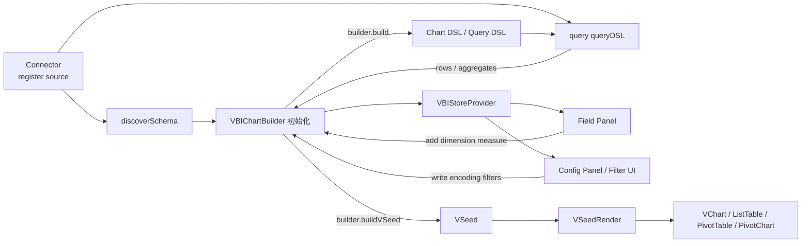
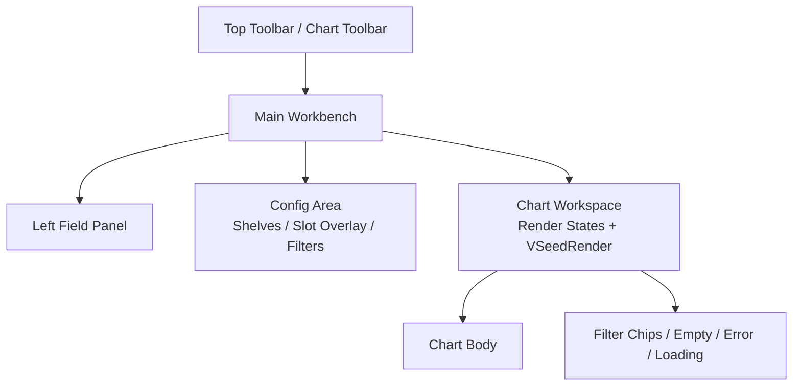
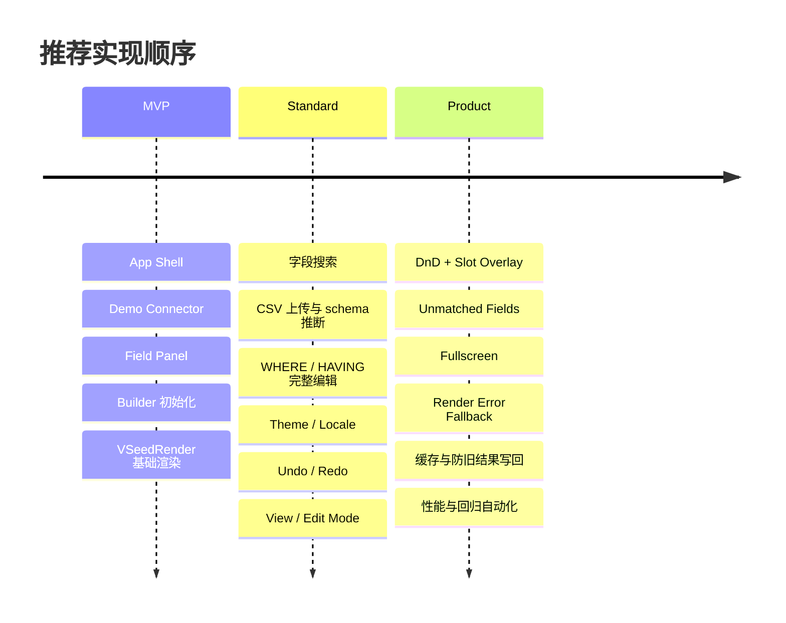

# 面向 Agent 的 VBI 图表构建器 UI 教程

注意：此文档中只是教学具体的UI布局实现该怎么更加美观一点，不可用来借鉴关于具体详细的功能实现。

## 目录

- Executive Summary
- 学习样板与总体设计法则
- 风格系统与页面骨架
- 模块逐项教程
- 迭代里程碑与实施步骤
- 质量、自测与自动化
- Prompt 模板与交付物

## Executive Summary

一个“直观、美观、顺滑”的图表构建器 UI，不是把图表、按钮、下拉框堆在一起，而是把一条清晰的认知链路做顺：**数据源接入 → 字段可见 → 映射可解释 → 筛选可回溯 → 图表可预览 → 错误可恢复**。Grafana 的 panel editor、Tableau 的 workspace 与 shelves、Metabase 的 step-by-step query builder、Superset 的 no-code explore，都在强调这条链路先于皮肤与装饰；Observable 和 Ant Design 则把“视觉层级、过滤器节制、概览先于细节”总结成了可以直接复用的页面原则。citeturn10view5turn11view0turn9view2turn13view3turn35view0turn36view4

对你的 VBI 场景而言，优秀 UI 的关键不是把 agent 约束成唯一模板，而是给它一套**可迁移的设计语法**：什么时候用左侧字段面板，什么时候用上方 shelves，什么时候用图上 slot overlay；什么时候即时预览，什么时候延迟提交；什么时候应该弹层，什么时候必须留在当前页面完成编辑。Ant Design 明确建议把概览、过滤、详情组织成稳定顺序，并强调尽量“留在当前页”；Observable 强调“Overview first, zoom and filter, then details-on-demand”；NN/g 则提醒，系统必须在合理时间内给出状态反馈，且界面不要堆砌不必要信息。citeturn8view2turn29view0turn35view0turn7view21turn8view10

“顺滑不卡顿”不是一句视觉形容词，而是工程要求。大字段列表要虚拟滚动，大数据图表要渐进渲染，非关键更新要走后台 transition，动画要优先使用 `transform` 与 `opacity`，而不是触发布局与重绘的属性；同时，异步查询必须防止旧结果回写新状态。React 官方文档明确说明 `useTransition` 适合后台渲染，但你在自定义异步状态管理里仍要自己处理请求顺序；VChart 提供 progressive rendering；MUI 与 web.dev 都把 virtualization 和高性能动效作为大型数据界面的基本能力。citeturn26view0turn26view1turn18view2turn25view3turn25view4turn7view13turn7view14

因此，这份教程的核心目标不是给 agent 一张“照着抄”的成品图，而是给出一套 **模块职责、布局尺寸、视觉 token、交互规则、风格变体、实施里程碑、自动化断言、Prompt 模板**。你可以把它当成一份“UI 生成训练教材”：先让 agent 学会稳定骨架与状态，再学映射与过滤，再学样式与动效，最后学产品级细节与回归自测。citeturn25view1turn25view5turn27view0turn24view3turn33search0

## 学习样板与总体设计法则

最成熟的图表构建器产品，虽然长相不同，但它们在页面组织上高度收敛：Grafana 把**数据查询 / 可视预览 / 右侧配置**分区；Tableau 把**字段窗格 / shelves / viz canvas**固定成一种空间语法；Metabase 把查询拆成**Pick data、Join、Filter、Summarize、Limit、Visualize**的步骤流；Superset 把连接数据、注册 dataset、配置图表和 dashboard 组合成端到端链路；Observable 强调**视觉锚点、大数字、协调视图、少而准的过滤器**；Ant Design 则把企业数据页概括为**summary → filters → details**。这些不是偶然，而是复杂分析应用对认知负荷的共同应答。citeturn10view0turn10view1turn11view2turn9view2turn13view0turn35view0turn36view4

下图分别对应成熟产品中最值得 agent 学习的界面模式：Grafana 的实时预览与右侧配置；Metabase 的步骤式 query builder；Tableau 的 shelves / marks card 心智模型；Superset 的 no-code chart builder。它们不是要你逐像素复刻，而是要提炼出“稳定布局 + 局部编辑 + 即时反馈”的生成规则。citeturn7view0turn7view1turn7view2turn13view3

iturn15image3turn17image4turn16image1turn16image10

| 产品样板                         | 你该学什么                                                                                    | 不要照抄什么                                              |
| -------------------------------- | --------------------------------------------------------------------------------------------- | --------------------------------------------------------- |
| Grafana Panel Editor             | 左侧/下方数据区 + 中央预览 + 右侧展示选项；保存/丢弃明确；表格视图可用于故障排查              | 监控领域特有的时间范围与告警文案                          |
| Tableau Workspace / Shelves      | 字段拖拽到 Rows / Columns / Marks / Filters 的空间语言；字段与图表同屏；拖拽位置可视化        | 桌面软件式高信息密度如果原样搬到 Web，会让新手压迫感过强  |
| Metabase Query Builder           | 把复杂查询拆成自然步骤；每一步都有预览；`limit` 放在链路末端                                  | 过于“表单式”的长页面在专业编辑模式下会显得松散            |
| Superset Explore                 | 数据连接到图表构建再到 dashboard 的全链路；主题和缓存可配置；no-code builder + semantic layer | 默认信息量较大，不适合最小可用版                          |
| Observable Dashboard Tips        | 大数字、锚点图、协调视图、过滤器节制、颜色跨图一致                                            | 如果照搬“叙事型 dashboard”节奏，编辑器可能弱化操作密度    |
| Ant Design Visualization Page    | 概览优先、过滤其次、详情按需；模块不要过多；同页完成主要任务                                  | 企业 dashboard 模板如果不加留白控制，容易显得“组件拼装”   |
| MUI Dashboard Layout / Data Grid | 标准 header + sidebar + scroll 区；深浅主题；密度、键盘、虚拟滚动约定清晰                     | 直接使用通用 dashboard 模板会缺少图表构建器特有的映射语义 |
| WAI / WCAG / APG                 | tabs、grid、焦点、可见性和键盘行为有明确标准                                                  | 不能把可访问性只留给后续修补                              |

上表对应的官方依据分别来自 Grafana、Tableau、Metabase、Superset、Observable、Ant Design、MUI 与 WAI 官方站点或帮助文档。citeturn10view0turn11view0turn11view4turn9view2turn13view3turn35view0turn36view4turn25view1turn24view3turn27view0

从这些样板抽象出来，agent 应该优先学习五条总法则。第一，**概览先于细节**：用户先看到结果，再逐层钻取；第二，**配置要留在上下文**：能在当前页完成就别打断到新页；第三，**每次只暴露一层复杂度**：默认只给最常用操作，专业功能延迟显露；第四，**所有交互都必须可反馈**：加载、空态、错误、成功、待提交都需要视觉状态；第五，**颜色和空间都要讲语义一致性**：跨图一致、跨组件一致、跨主题一致。citeturn35view0turn29view0turn7view21turn36view4turn35view2

下面这张数据流图，建议直接作为 agent 生成页面时的“内部心智模型”。只有当它理解了 **Connector、Builder、Store、Workspace、VSeedRender** 各自的边界，页面才会自然地又稳又清晰。公开可检索的 VisActor 文档里，VSeed 目前更多以产品入口出现，公开 API 细节不如 VChart / VTable 完整，因此本文在 VSeedRender 的底层建议上主要依赖 VChart / VTable 的官方文档与你给出的项目约定，不猜测未公开 API。citeturn31view0turn18view3turn19view1turn18view4turn21view1turn32view0



## 风格系统与页面骨架

App Shell 不应该被设计成“看起来很复杂的三栏系统”，而应该被设计成“看起来稳定、用户一眼知道哪里是字段、哪里是配置、哪里是结果”的工作台。Ant Design 的 layout 规范把左-右布局定义为固定左导航 + 自适应右工作区；MUI 的 `DashboardLayout` 则把 header、sidebar、scrollable content 区抽象成可复用模式；Tableau 允许 side bar 折叠、cards 重排；这些都说明图表构建器的外框最重要的是**稳定和可预测**，而不是新奇。citeturn23view0turn25view1turn30view0

你可以把整页理解成“上方命令层 + 中间工作台 + 中央渲染核”的三段式结构。用户的目光路径应该从左上或上中进入，再被主图或关键数字吸引，然后再回到字段/过滤/配置；Observable 与 Ant Design 都建议把最重要的信息放在最突出的区域，并把 summary 放在前面、filters 放在中段、details 放在后面。对编辑器来说，这意味着 chart workspace 必须永远是主视觉区，而字段与配置只是辅助。citeturn35view0turn36view4



下面这组风格不是“唯一标准答案”，而是给 agent 学习用的三种**设计语法**。它们都应遵守同一功能边界，但视觉密度、留白比例、边框强弱、动画显隐方式可以不同。

| 风格         | 适用阶段                       | 页面气质                       | 典型布局                                   | 示例配色                                                                         | 排版建议                                                       |
| ------------ | ------------------------------ | ------------------------------ | ------------------------------------------ | -------------------------------------------------------------------------------- | -------------------------------------------------------------- |
| minimalist   | 最小可用版、内测工具、快速验证 | 轻、净、低装饰、直给           | 双栏或伪三栏；无厚重卡片；配置折叠         | `bg #F7F8FA` `surface #FFFFFF` `text #111827` `primary #2563EB` `accent #14B8A6` | 标题 20/28，正文 14/22，标签 12/18；字重 500/600               |
| standard     | 面向团队共享、功能较完整       | 均衡、清楚、企业感适中         | 三栏工作台；顶部命令清晰；shelves 常驻     | `bg #F5F7FB` `surface #FFFFFF` `text #1F2937` `primary #1677FF` `accent #7C3AED` | 标题 22/30，正文 14/22，说明 12/18；字重 500/600/700           |
| professional | 产品级、专家模式、复杂配置     | 稠密、精确、可扩展、带层级光感 | 主图上 overlay + 左字段浏览器 + 右高级设置 | `bg #0B1220` `surface #121A2A` `text #E5E7EB` `primary #4F8CFF` `accent #22C55E` | 标题 18/28，正文 13/20，辅助 12/18；必要处可用等宽字体显示 DSL |

在视觉 token 上，建议以 **8pt 节奏**为主，允许 4pt 微调。Ant Design 直接把 8 作为布局基础单位，并在栅格与常用尺度中反复强调“倍数化、节奏化”的空间系统；MUI 的 dark mode 文档则表明深浅主题切换应建立在统一的 palette 体系上，而不是为暗色单独再造一个零散颜色表。citeturn23view0turn25view5

| Token 类别         | 建议值                                   | 说明                                               |
| ------------------ | ---------------------------------------- | -------------------------------------------------- |
| spacing            | `4 / 8 / 12 / 16 / 24 / 32`              | 组件内部优先 8、12、16；外层分区优先 24、32        |
| radius             | `8 / 12 / 16`                            | chip 用 8，面板用 12，浮层大容器可到 16            |
| border             | `1px solid var(--border-subtle)`         | 让信息分区靠细边与留白，而不是厚阴影               |
| shadow             | `sm / md` 两档即可                       | standard 用轻阴影，professional 用更浅但更广的阴影 |
| focus ring         | `2px` 外描边                             | 主题切换不改焦点语义，只改色值                     |
| toolbar height     | `56` 或 `64`                             | 高度稳定，避免多行换行                             |
| secondary toolbar  | `48` 或 `52`                             | Chart Toolbar / Filter Bar / Tab Strip             |
| field panel width  | `280–320`                                | 超过 320 易压缩主图；低于 260 易挤字段名           |
| config panel width | `320–380`                                | 专业模式可改成 overlay，不强占常驻宽度             |
| chart min height   | `480–640`                                | loading / empty / error / rendered 共用同一高度    |
| motion duration    | `140–180ms` 微交互；`180–240ms` 面板显隐 | 仅作建议；需支持 reduced motion                    |
| motion easing      | `ease-out` 为主                          | 入场别拖泥带水，出场别突兀                         |

颜色上，agent 应学习的是**语义一致**，而不是“越多越炫”。Observable 明确提醒：如果同一种颜色在多个视图里重复出现，它应该代表同一个含义；同时，人能稳定区分的类别色并不多，过多色相会造成理解负担。对图表构建器 UI 来说，字段角色色、slot 高亮色、图例色、主题主色应该各司其职，而不是互相抢语义。citeturn35view2

## 模块逐项教程

先给 agent 一个总表，会比让它直接写页面有效得多。因为它需要先理解“每个区域是干什么的”，再决定如何排版、如何命名组件、如何组织状态。

| 模块                                  | 首要目标                                  | 用户第一眼应该明白什么               | 最容易做丑/做卡的点                  |
| ------------------------------------- | ----------------------------------------- | ------------------------------------ | ------------------------------------ |
| App Shell                             | 提供稳定框架与模式切换                    | 哪些是全局控制，哪些是编辑区         | 高度跳动、模式切换改天改地           |
| Top Toolbar / Chart Toolbar           | 集中核心命令                              | 图表类型、主题、语言、数据入口在这里 | 图标过密、按钮顺序混乱               |
| Field Panel                           | 让字段可发现、可搜索、可添加              | 哪些是维度，哪些是指标               | 长字段名撑坏布局、滚动卡顿           |
| Config Panel / Shelves / Slot Overlay | 告诉用户“图是怎么被组出来的”              | X/Y/颜色/大小/过滤等映射关系         | slot 太抽象、代币不可编辑            |
| Filter UI                             | 区分 WHERE / HAVING，清楚展示当前过滤     | 当前为什么看到这些数据               | 每次键入都全量查询、HAVING 语义不清  |
| Chart Workspace                       | 维持主视觉与状态稳定                      | 图、空态、错误态都在这里发生         | loading/empty/error 高度抖动         |
| VSeedRender                           | 严格做渲染边界                            | 这里不负责业务编辑，只负责画         | 未销毁旧实例、渲染重复               |
| Data Source / Connector               | 让数据接入和 schema 发现可见              | 数据从哪里来、已加载到什么程度       | query 不执行 DSL，直接回原始数据     |
| Store / Provider                      | 集中 builder、dsl、schema、loading、error | 页面状态有单一来源                   | 异步旧结果回写                       |
| Builder 初始化                        | 建立默认图与默认字段                      | 一开页就能出结果或出可理解空态       | 默认值杂乱、初始化后还要用户点很多次 |

**App Shell / 页面框架 / Builder 初始化 / Store Provider**

目标是把“系统级状态”和“编辑级状态”分开。App Shell 管全局主题、语言、全屏、编辑/查看模式和 provider 挂载；Builder 初始化负责默认 chart type、默认维度/指标、limit、theme、locale；Store Provider 则是唯一可信状态源，保存 `builder、dsl、schema、loading、vseed、error、initialized`，并监听 `builder.doc.on('update')` 触发重建。MUI 的 `DashboardLayout` 明确要求用 provider 提供上下文；Tableau 的 workspace 允许折叠 side bar、切换 presentation mode；Grafana 也把返回、保存、丢弃等全局行为固定在顶部，这些都说明 App Shell 的职责是“稳”，不是“多”。citeturn25view1turn30view0turn10view1

布局上，建议 header 高度 56 或 64，主工作台用 CSS Grid：`280–320 / minmax(0,1fr) / 320–380`。如果是 minimalist，可以把右侧配置面板做成抽屉；如果是 professional，可以把常驻右栏缩成图上 overlay，只保留高级设置入口。一定要让 chart workspace 的可用空间尽可能大，因为 Ant Design 和 Observable 都强调主信息位置必须最突出。citeturn23view0turn36view4turn35view0

在异步重建上，建议把 builder 的重新 build 视为“可打断、可合并”的后台更新：UI 立即更新选中态，真正的 build / query / buildVSeed 在 transition 中进行；但要同时维护 `requestSeq` 或 `version`，只接受最后一次请求的返回值。React 官方文档明确提醒：Transitions 不会自动帮你处理自定义异步状态更新的请求顺序，所以防旧结果回写必须自己做。citeturn26view0turn26view1

```tsx
function AppShell() {
  return (
    <ConfigProvider theme={theme} locale={locale}>
      <VBIStoreProvider connector={connector}>
        <div className='app-shell'>
          <TopToolbar />
          <main className='workbench'>
            <FieldPanel />
            <ConfigArea />
            <ChartWorkspace />
          </main>
        </div>
      </VBIStoreProvider>
    </ConfigProvider>
  )
}
```

```ts
useEffect(() => {
  let disposed = false
  let off: (() => void) | undefined

  async function boot() {
    const schema = await connector.discoverSchema()
    const builder = new VBIChartBuilder().setChartType('bar').setLimit(200).setTheme(theme).setLocale(locale)

    builder.setSchema(schema)

    off = builder.doc.on('update', async () => {
      const seq = ++seqRef.current
      setState((s) => ({ ...s, loading: true }))

      try {
        const dsl = await builder.build()
        const vseed = await builder.buildVSeed()
        if (disposed || seq !== seqRef.current) return

        setState((s) => ({
          ...s,
          dsl,
          vseed,
          loading: false,
          initialized: true,
          error: null,
        }))
      } catch (error) {
        if (disposed || seq !== seqRef.current) return
        setState((s) => ({ ...s, loading: false, error }))
      }
    })
  }

  boot()
  return () => {
    disposed = true
    off?.()
  }
}, [connector, theme, locale])
```

常见坑有三个。第一，把字段面板、图表区、设置区都做成会自己伸缩高度的区域，结果一加载图表布局就跳。第二，Builder 初始化和 Connector 切换耦合得太紧，导致换数据源后旧的 dimensions / measures / filters 还残留。第三，只做“编辑模式”，没有“查看模式”，页面始终像开发工具而不是产品。Tableau 的 presentation mode 和 Grafana 的保存/丢弃分层都在告诉我们：**模式切换本身也是产品功能**。citeturn30view0turn10view6

**Top Toolbar / Chart Toolbar**

这个区域的目标不是放下所有按钮，而是把“高频且可全局生效的命令”稳定收口。Grafana 的 panel header 和 preview 区提供了返回、保存、丢弃、刷新、表格视图与时间范围；Metabase 把 `Filter`、`Summarize`、`Join data`、`Row limit`、`Visualize` 放在连续步骤里；Tableau 则把分析和导航工具置于 toolbar。VBI 的 toolbar 最合适的内容就是你列出的那组：图表类型、主题、语言、limit、undo/redo、全屏、Load Demo、Upload CSV、数据源切换、配置面板开关。citeturn10view1turn10view2turn9view2turn11view1

布局建议是左中右三组：左侧放数据入口与编辑历史，中间放 chart type 与 view/edit mode，右侧放主题、语言、limit、fullscreen、settings。图表类型不要只做一排小图标；它应该至少有“当前激活态 + 悬停预览态 + 可选文本标签”三层信息。Grafana 在 display options 里会根据数据形状给出可视化建议，且 panel styles 用 live preview 卡片展示样式变化；这是很好的启发：chart type 切换不一定靠纯文字下拉，也可以用更易读的 segmented preview。citeturn10view0turn10view3

如果 chart type 切换会导致明显的重新构建或请求延迟，建议不要做“焦点即激活”的 tabs，而要做“焦点切换、回车确认”或“点击确认”。WAI 的 Tabs Pattern 明确指出，只有在 panel 内容能无明显延迟地显示时，才推荐自动激活；否则会显著拖慢键盘导航体验。citeturn27view0

删除 token、删除 filter、重置某个 slot 这类可撤销操作，优先用 **toast + undo**，不要动不动双确认 Modal。Ant Design 的 Stay on the Page 直接建议：能提供撤销机会时，优先 undo，而不是额外的 double-confirm overlay。这个规则非常适合 Toolbar 的 Reset Encoding、Remove Token、Clear Filter 等场景。citeturn29view0

```tsx
<header className='top-toolbar'>
  <div className='toolbar-left'>
    <DataSourceSwitcher />
    <LoadDemoButton />
    <UploadCSVButton />
    <UndoRedoGroup />
  </div>

  <div className='toolbar-center'>
    <ChartTypePicker />
    <ModeToggle />
  </div>

  <div className='toolbar-right'>
    <ThemeSwitch />
    <LocaleSwitch />
    <LimitInput />
    <FullscreenButton />
    <SettingsButton />
  </div>
</header>
```

**Field Panel / 数据字段面板**

字段面板的任务不是“列出 schema”，而是“让用户用最少的认知动作找到可用字段并开始分析”。Tableau 会在 Data pane 按字段角色展示内容，并用拖拽到 shelves/cards 的方式构建分析；Metabase 的 data picker 支持搜索、预览、勾选显示列；Tableau 还明确区分 dimension 与 measure，说明字段角色分组本身就是分析工具的一部分。citeturn11view0turn9view2turn37search0

布局建议是固定宽度 280–320，顶部有粘性搜索框，下面按 `Dimensions` / `Measures` / `Derived` / `Time` 等组展示。长字段名必须单行省略，绝不能撑开 panel。字段 item 建议由四部分构成：角色色条或小圆点、字段名、类型/聚合提示、操作 affordance。颜色只用于角色区分，不要再叠加一堆状态彩色徽标；否则很快就失控。citeturn35view2turn8view10

交互层面，搜索建议 120–180ms debounce；字段数量达到几十或上百时，列表必须虚拟滚动。web.dev 和 MUI 都把 large lists / data grid virtualization 视为基础性能能力，因为 DOM 虚拟化可以显著降低渲染成本。拖拽时要有三件事：**被拖对象的 ghost、合法 slot 的高亮、非法 slot 的禁用反馈**。Tableau 的 workspace 重排帮助页还特别提到，拖拽 card 时合法位置会高亮出来；这类“落点可视化”是你专业模式里最值得学的反馈。citeturn7view13turn25view3turn30view0

字段详情说明、样本值预览、别名说明这类 hover 信息，不要一上来就瞬发。Ant Design 对 detail overlay 的建议是 hover 触发时加约 0.5 秒延迟，移出则立即关闭，这能减少“鼠标扫过一片字段时全是闪烁浮层”的噪音。citeturn29view0

```tsx
<aside className='field-panel'>
  <div className='field-search'>
    <SearchInput placeholder='搜索字段' />
  </div>

  <FieldGroup title='Dimensions'>
    <VirtualizedFieldList fields={dimensionFields} onClickField={addDimension} draggable />
  </FieldGroup>

  <FieldGroup title='Measures'>
    <VirtualizedFieldList fields={measureFields} onClickField={addMeasure} draggable />
  </FieldGroup>
</aside>
```

常见坑是：把字段排序做成单一字母序，结果业务上最常用字段被冲到很下面；长字段名没有 tooltip；点击添加与拖拽添加的行为不一致；dimension / measure 的视觉区分只靠文字，不靠颜色或图标，导致扫描效率低。更进一步的产品级优化是加入“最近使用字段”“推荐字段”“未匹配字段”区域，但前提是基础 panel 必须 already 清楚。citeturn35view0turn37search0

**Config Panel / Shelves / Slot Overlay**

这是用户真正“组图”的地方。Tableau 的 shelves 与 Marks card 说明，一个好的配置面板不是在表单里堆参数，而是让人直接看到字段如何映射到结构、明细层级、颜色、大小、标签和过滤；Grafana 则展示了右侧 display options 如何承接 visualization preview；Ant Design 的 Stay on the Page 又提供了 overlay / inlay 的思路，非常适合 professional 模式下的图上 slot 配置。citeturn11view4turn10view3turn29view0

因此你可以保留两种主形态。**standard 形态**使用上方 shelves：`Dimensions / Measures / WHERE / HAVING` 一次铺开，适合清楚、教学化、低理解门槛的场景。**professional 形态**使用 slot overlay：在图表附近显示 `X / Y / Color / Size / Detail / Label` 等槽位，随着 chart type 变化动态出现或消失；未匹配字段单独给一个区域，绝不静默丢失。从 Tableau 和 Grafana 的经验看，好的配置区要同时满足“看得出结构”和“配得进细节”这两个目标。citeturn11view0turn11view4turn10view0

Token 设计要把“这是一段映射关系”讲清楚。一个 token 至少应支持：删除、重命名、aggregate 修改、encoding 修改、sort / format、drag 排序。professional 模式下可以把 token 菜单做成 context menu 或 popover；standard 模式下直接在 token 尾部加 dropdown trigger 更直观。对可撤销删除，仍然优先 undo，而不是 confirm modal。citeturn29view0turn8view10

```tsx
<section className='config-panel'>
  <ShelfPanel>
    <Shelf title='Dimensions' accepts={['dimension', 'time']}>
      <FieldToken />
      <AddSlotButton />
    </Shelf>
    <Shelf title='Measures' accepts={['measure']}>
      <FieldToken />
    </Shelf>
    <Shelf title='WHERE' accepts={['dimension', 'measure']} />
    <Shelf title='HAVING' accepts={['measure']} />
  </ShelfPanel>

  <SlotOverlay>
    <Slot id='x' />
    <Slot id='y' />
    <Slot id='color' />
    <Slot id='size' />
    <Slot id='detail' />
  </SlotOverlay>
</section>
```

```ts
builder.setChartType('bar')
builder.setDimensions([{ field: 'region' }])
builder.setMeasures([{ field: 'sales', aggregate: 'sum' }])
builder.setEncoding('color', { field: 'segment' })
builder.setSort('sales', 'desc')
builder.setFormat('sales', 'currency')
```

最容易踩的坑有四个。第一，slot 名称跟 chart type 强耦合，一改图表类型，字段突然消失，却没有“未匹配字段”区域接住。第二，token 只能删不能改，导致用户每次都要重加。第三，drag/drop 没有插入指示线，用户只能“猜”会掉到哪里。第四，把每个小修改都做成 Modal，彻底打断编辑流。Ant Design 的同页原则和 Tableau 的拖拽反馈都在说明：**映射操作必须是局部、即时、可逆的**。citeturn29view0turn30view0

**Filter UI / WHERE 与 HAVING**

Filter UI 的关键不是做一个“筛选对话框”，而是让用户明白当前图到底被哪些条件裁剪过。Tableau 单独设置 Filters shelf；Metabase 把 filter 作为构建过程中的正式步骤；Observable 和 Ant Design 都提醒：过滤器很重要，但不能无限增长，过多过滤会拖垮理解和交互速度。对你的项目，WHERE 和 HAVING 必须明确分离，且 HAVING 必须带 aggregate。citeturn11view5turn9view0turn35view2turn36view4

建议把 Filter UI 拆成两层。第一层是 **可见 chips 条**：显示当前生效的 WHERE / HAVING 条件、根操作符 AND/OR、每个条件的快速删除入口。第二层是 **编辑器**：式样可以是 drawer，也可以是 popover modal，但一定要按字段类型切换 value editor，例如日期区间、数字比较、类别多选、文本匹配。WHERE 应过滤原始行；HAVING 应过滤聚合结果；按照你的约束，多值 WHERE 不直接写 `op: in`，而写 `op: '=' + array` 让 VBI / VQuery 做转换。这个规则要明确体现在 UI 文案和自测里。citeturn11view5turn9view1

交互上，值列表搜索需要 debounce，远程枚举值要显示 loading；高延迟数据源下，输入过程不要立刻全量 query，优先“编辑中草稿态 + Apply 提交”。Observable 明确指出，交互太慢时用户会失去继续提问的欲望；所以 Filter UI 的顺滑度，决定了你的页面到底像“探索工具”还是“缓慢的后台表单”。citeturn35view2turn7view21

```tsx
<FilterBar>
  <RootOperatorToggle value='AND' />
  <FilterChip scope='where' />
  <FilterChip scope='having' />
  <AddFilterButton />
</FilterBar>
```

```ts
const whereRule = {
  scope: 'where',
  field: 'region',
  op: '=',
  value: ['东北', '华北'], // 让底层转换 multi-select
}

const havingRule = {
  scope: 'having',
  field: 'sales',
  aggregate: 'sum',
  op: '>',
  value: 100000,
}
```

常见坑是：让 WHERE / HAVING 混在一起展示；chip 上只显示字段名，不显示操作符和值；多选值全部展开成超长文本，把布局撑坏；HAVING 没选聚合就允许提交；每个字符输入都触发 rebuild。好的 Filter UI 应该让用户**扫一眼就知道为什么数据变了**。citeturn11view5turn35view2

**Chart Workspace / 图表工作区**

这是整个页面的主视觉区，也是用户对“美不美、顺不顺”的第一判断对象。Grafana 的 visualization preview 提供了表格切换和刷新；Ant Design 强调关键图和 scorecard 应优先摆在上部，模块数控制在 5–9 以内；NN/g 强调 visibility of system status；Observable 强调视觉锚点、大数字与协调视图。综合起来，Chart Workspace 应满足四个目标：主信息突出、状态稳定、反馈可见、辅助控制不过度喧宾夺主。citeturn10view1turn36view4turn7view21turn35view0

布局建议是：顶部 `ChartToolbar`，下面 `FilterChips / Mode Chips`，再下面是一个**高度稳定**的 `ChartBody`。`initializing / no data / empty chart / loading / render error / rendered chart` 六种状态必须共享同一容器高度，至少在主要断点下保持一致，这样 loading 和 empty 不会让页面上下抖动。图表是图表，状态层是状态层；不要每次出错就把整个 canvas 卸掉。citeturn7view21turn8view10

动画只做辅助，不做主角。web.dev 明确建议高性能动画尽量使用 `transform` 和 `opacity`，避免触发布局或重绘的属性；因此 loading shimmer、panel slide、slot glow、drag insertion 都应避开 `width / height / left / top` 的频繁动画。图表本身如果需要切换，不要给整个 workspace 做大范围位移动画，而应使用淡入、局部渐变或 placeholder 过渡。citeturn7view14

Grafana 的表格切换是很值得学习的“故障排查后门”：当用户说“图不对”时，给他一个一键切回表格或原始预览的通道，能极大减少解释成本。Metabase 的 preview step 也说明，在复杂构建过程中，适度的数据预览不是噪音，而是降低错误率的工具。citeturn10view1turn9view2

```tsx
<section className='chart-workspace'>
  <ChartToolbar />
  <FilterChipRow />
  <div className='chart-stage'>
    <RenderStateBoundary
      initializing={<InitializingState />}
      loading={<LoadingState />}
      empty={<EmptyState />}
      error={<ErrorState />}
    >
      <VSeedRender />
    </RenderStateBoundary>
  </div>
</section>
```

常见坑是：把 loading 做成很小一条 spinner，导致整个页面看起来像“图没撑开”；空态没有告诉用户下一步怎么做；render error 只有一行技术报错；workspace 上方堆满辅助面板，把图压成邮票大小。真正产品级的做法，是让图始终占主位，控制只在需要时浮现。citeturn36view4turn35view0

**VSeedRender / 渲染边界**

VSeedRender 的职责必须收紧：**只负责把 VSeed 变成 VChart / VTable，不负责字段选择、filter 编辑、store 初始化**。这一点如果不立界，agent 很容易把业务逻辑、请求逻辑和渲染实例化逻辑混成一个大组件。公开文档里，VChart 明确给出了 `new VChart(spec, options)`、`renderSync`、`updateSpec`、`release`、`useRegisters` 等 API；React-VTable 则明确给出了 `ListTable / PivotTable / PivotChart` 三种 React 组件，以及按需加载与组件注册方式。citeturn19view1turn19view2turn19view3turn19view0turn18view4turn18view5turn18view6turn32view1

因此，初始化策略很清楚。对于 VChart：优先用稳定容器实例化图表，必要时 `updateSpec`，卸载时 `release`。官方 API 还说明 `renderAsync` 在 1.9.0 之后不再推荐，异步渲染相关 API 未来将被弃用；这意味着新的实现更适合 `renderSync + 明确更新` 的策略。对于 VTable：如果你走 React 包装层，就使用类型切换渲染 `ListTable / PivotTable / PivotChart`；如果你做更底层实例封装，则把实例生命周期包在统一 boundary 中。citeturn19view3turn19view0turn18view4turn18view5

VChart 的主题控制和性能优化也很适合纳入 VSeedRender 内部：主题可以通过 spec 或 `ThemeManager` 注册与热更新；大数据时可以启用 progressive rendering；首屏 bundle 需要控制时可以用 `useRegisters` 按需注册。VTable 侧则可以利用 `ListTableSimple / PivotTableSimple` 与按需注册标题、tooltip、legend、animation 等组件来优化包体。citeturn18view1turn18view2turn18view6turn32view1

```tsx
function VSeedRender({ vseed, theme }: { vseed: VSeed | null; theme: string }) {
  const hostRef = React.useRef<HTMLDivElement | null>(null)
  const chartRef = React.useRef<any>(null)

  React.useEffect(() => {
    if (!vseed || vseed.kind !== 'vchart' || !hostRef.current) return

    const spec = VSeedBuilder.from({ ...vseed, theme }).build()
    const chart = new VChart(spec, { dom: hostRef.current })
    chart.renderSync()
    chartRef.current = chart

    return () => {
      chartRef.current?.release()
      chartRef.current = null
    }
  }, [vseed, theme])

  if (!vseed) return <EmptyState />

  if (vseed.kind === 'list-table') {
    return <ListTable key={vseed.key} option={vseed.option} />
  }

  if (vseed.kind === 'pivot-table') {
    return <PivotTable key={vseed.key} option={vseed.option} />
  }

  if (vseed.kind === 'pivot-chart') {
    return <PivotChart key={vseed.key} option={vseed.option} />
  }

  return <div ref={hostRef} className='chart-host' />
}
```

常见坑是：旧图表实例没销毁，内存涨；chart type 一变就整页 remount，失去局部稳定性；把 schema、builder、query 写进 VSeedRender，导致职责污染；暗色主题切换只换外层背景，没有同步 VChart / VTable 内部主题。VSeedRender 的好坏，决定的是“渲染边界是否专业”，不是“页面是否花哨”。citeturn19view0turn18view1turn21view0

**Data Source / Connector**

成熟产品都把“数据连接”和“字段建模”当成正式入口，而不是附属功能。Superset 的 first dashboard 教程先连接数据库，再注册 dataset；Metabase 清楚区分数据存储与元数据存储，query builder 会利用 syncs / scans 获取 schema、列类型和过滤器枚举值，并把具体查询发回数据库执行；这意味着你的 connector 也应该承担两个责任：`discoverSchema()` 暴露可建模字段，`query()` 执行 queryDSL 并返回结果，而不是直接把原始 dataset 甩给前端。citeturn13view0turn31view0

UI 层至少应支持 Demo Connector、CSV 上传、本地数据加载、schema 推断和数据源切换。切换数据源后，应清空旧的 dimensions / measures / filters / sort / encoding，这不是体验细节，而是数据正确性要求。Metabase 与 Superset 的文档都说明元数据与 dataset 注册是正式的建模步骤，而不是“顺便猜一下”。citeturn13view0turn31view0

如果你后续要做产品级性能优化，Store 可以学习 Metabase / Superset 的思想：缓存的是**结果和元数据**，不是原始数据所有权；Metabase 明确说明它不存你的源数据，而会缓存结果、维护 metadata，并在 application database 中加速界面；Superset 也提供了可配置 caching layer 以及 semantic layer。对你的页面来说，这对应“connector query 结果缓存、schema 缓存、sample values 缓存、CSV 推断缓存”。citeturn31view0turn13view3

```ts
type SchemaField = {
  key: string
  title: string
  role: 'dimension' | 'measure'
  dataType: 'string' | 'number' | 'date' | 'boolean'
  sampleValues?: string[]
}

type Connector = {
  discoverSchema(): Promise<SchemaField[]>
  query(dsl: QueryDSL): Promise<QueryResult>
}
```

常见坑是：CSV 上传后只显示“已成功”，却不展示推断出的 schema；connector 的 query 忽略 DSL，永远返回全量原始数据；切换数据源不 reset builder；本地 connector 与远程 connector 在字段 role 规则上不一致。一个可靠的数据入口，会让 agent 生成的页面天然显得专业。citeturn13view0turn31view0

**功能分层清单**

你给出的最小 / 标准 / 产品级分层，本身就很合理。真正要教给 agent 的，不是“把所有功能一次性堆完”，而是明确哪些能力属于**骨架闭环**，哪些属于**自助分析增强**，哪些属于**产品竞争力**。

| 层级     | 必须完成的能力                                                                                                                                                       | UI 重点                          |
| -------- | -------------------------------------------------------------------------------------------------------------------------------------------------------------------- | -------------------------------- |
| 最小可用 | 加载数据、展示字段、添加 dimension、添加 measure、切换 chart type、修改 limit、添加 WHERE filter、渲染图表、loading / empty 状态                                     | 看懂结构、能出图、空态不困惑     |
| 标准完整 | HAVING、undo/redo、theme / locale、CSV 上传、schema 推断、字段搜索、token 删除/排序/聚合/encoding、view / edit mode、i18n、深浅主题                                  | 可自助分析、可共享、可持续使用   |
| 产品级   | drag/drop 字段映射、动态 slot、unmatched fields、config overlay、filter modal、字段 token 菜单、fullscreen、render error fallback、更强 store 缓存与异步防旧结果写回 | 高效、高密度、专家友好、系统稳定 |


## 迭代里程碑与实施步骤

先做“又快又完整”的页面，通常会得到“什么都有，但什么都不顺”的坏结果。成熟产品的共同经验是：先打通主链路，再增加分析能力，再增加舒适性与产品化。Metabase 的 query builder 步骤、Superset 的 first dashboard 教程、Grafana 的 preview / options 分区，本质上都在强调一件事：**先让结果出现，再让配置变强，再让体验变顺**。citeturn9view2turn13view0turn10view0



| 里程碑         | 实现内容                                                                   | 预期产出                           | 测试方法                                | 性能 / 可访问性检查点                      |
| -------------- | -------------------------------------------------------------------------- | ---------------------------------- | --------------------------------------- | ------------------------------------------ |
| 骨架与数据通路 | App Shell、Top Toolbar、Demo Connector、Builder 默认值、Store Provider     | 一打开页面就能看到字段和基础空态   | 手动切 demo 数据，验证 schema 正确加载  | header 高度稳定；初始焦点顺序合理          |
| 字段与出图闭环 | Field Panel、添加 dimension / measure、chart type、limit、基础 VSeedRender | 从字段点击到图表出现形成闭环       | 选 1 个 dimension + 1 个 measure 出柱图 | 字段列表滚动不卡；图表区最小高度固定       |
| 基础筛选与状态 | WHERE filter、loading / empty / no data                                    | 用户知道自己在看什么、为什么没数据 | 过滤后验证行数与图变化一致              | loading / empty / error 不引发布局跳动     |
| 标准编辑能力   | HAVING、字段搜索、token 编辑、theme / locale、undo/redo                    | 页面达到“团队可用”                 | 回归不同图表类型下 token 操作           | 搜索 debounce；深浅主题对比度过关          |
| 数据入口完善   | CSV 上传、本地 connector、schema 推断                                      | 用户能自带数据试用                 | 上传不同类型 CSV，验证字段 role         | 大文件上传有进度；失败有明确错误           |
| 产品级强化     | DnD、overlay、fullscreen、缓存、防旧结果写回、error fallback               | 页面可长期演进为产品               | 自动化回归 + 视觉对比                   | 虚拟滚动、渐进渲染、键盘导航、ESC 退出全屏 |

每个里程碑都应该产出真实可见的结果，而不是“代码更完整了”。例如，MVP 结束时必须已经有一条能跑通的工作流：**Load Demo → 字段可见 → 添加维度/指标 → 渲染图表 → 看见 loading / empty**。如果这条链路还不完整，就不要急着做 professional overlay，因为 overlay 只会把基础问题隐藏起来。citeturn13view0turn35view0

## 质量、自测与自动化

“不卡顿”的最小技术底线，是不要让任何一个可预期的大列表或大图表直接全量同步渲染到 DOM。字段面板、预览表格、长枚举值选择器、表格模式都要引入虚拟滚动；VChart 大数据场景应启用 progressive rendering；VTable 与 React-VTable 场景应考虑按需加载和简化组件；这几项优化都来自官方文档，而不是锦上添花的小技巧。citeturn25view3turn25view4turn18view2turn32view1turn21view0

“顺滑”的第二条底线，是让非关键更新变成后台更新，并始终给出 pending visual state。React 文档建议用 `useTransition` 在后台渲染 UI；同时，它也明确提醒自定义异步库必须自己保证请求顺序。对你的 store 来说，这意味着：切换 chart type、调整 slot、修改 filter 时，按钮和 chip 状态可立即更新，但 `builder.build()`、`connector.query()`、`builder.buildVSeed()` 的结果只允许最后一次写回。citeturn26view0turn26view1

“好看”的第三条底线，是动效不要破坏性能。web.dev 明确建议高性能动画优先 `transform` 与 `opacity`，避免 layout / paint 成本高的属性；Ant Design 又强调同页交互的连贯性。因此，slot hover、panel expand、token insert、toast undo、filter drawer 等效应，都应更偏向轻量渐变与位移，而不是复杂层叠动画。citeturn7view14turn29view0

“可用”的第四条底线，是按 WCAG / WAI 做基础可访问性。WCAG 2.2 以可感知、可操作、可理解、健壮四大原则组织；WAI 的 Tabs Pattern 给了 tabs 的键盘规范；MUI Data Grid 的文档则展示了 density、tab sequence 和键盘导航的一整套工程实现。对图表构建器而言，这直接对应：可见焦点、正确 role、键盘可操作的 chart type tabs / shelves / tokens、以及深浅主题下的可读对比。citeturn7view11turn27view0turn24view3

**自动化断言示例：Jest**

```ts
describe('store stale result guard', () => {
  it('ignores older async rebuild result', async () => {
    const state = createStore()
    const p1 = state.rebuild({ version: 1, delay: 50, result: 'old-vseed' })
    const p2 = state.rebuild({ version: 2, delay: 10, result: 'new-vseed' })

    await Promise.all([p1, p2])

    expect(state.getState().vseed).toBe('new-vseed')
    expect(state.getState().error).toBeNull()
  })

  it('clears fields and filters when datasource changes', async () => {
    const state = createStore()
    state.addDimension('region')
    state.addMeasure('sales')
    state.addWhereFilter({ field: 'region', op: '=', value: ['华北'] })

    await state.switchConnector(mockConnectorB)

    const s = state.getState()
    expect(s.dimensions).toEqual([])
    expect(s.measures).toEqual([])
    expect(s.where).toEqual([])
    expect(s.having).toEqual([])
  })
})
```

**自动化断言示例：Playwright**

```ts
test('basic chart builder workflow is stable', async ({ page }) => {
  await page.goto('/chart-builder')

  await page.getByRole('button', { name: /load demo/i }).click()
  await expect(page.getByText(/dimensions/i)).toBeVisible()

  const stageBefore = await page.locator('.chart-stage').boundingBox()

  await page.getByText('Region').click()
  await page.getByText('Sales').click()

  await expect(page.locator('.chart-host, canvas')).toBeVisible()

  const stageAfter = await page.locator('.chart-stage').boundingBox()
  expect(stageBefore?.height).toBe(stageAfter?.height)

  await page.getByRole('button', { name: /fullscreen/i }).click()
  await page.keyboard.press('Escape')

  await expect(page.getByRole('tab', { name: /bar/i })).toBeVisible()
})

test('tabs are keyboard accessible', async ({ page }) => {
  await page.goto('/chart-builder')
  await page.keyboard.press('Tab')
  await page.keyboard.press('ArrowRight')
  await page.keyboard.press('Enter')

  const selected = page.getByRole('tab', { selected: true })
  await expect(selected).toBeVisible()
})
```

**自动化断言示例：渲染边界伪代码**

```ts
if (nextVseed.kind !== prevVseed.kind) {
  releasePreviousRenderer()
  mountNextRenderer()
} else if (nextVseed.kind === 'vchart') {
  vchart.updateSpec(nextSpec)
} else {
  rerenderReactTableWithStableKey(nextVseed.key)
}
```

这套自动化不只是为了防 bug，也是为了教 agent 形成正确的生成目标。只要 CI 中明确断言“高度不跳、旧结果不回写、tabs 可键盘切换、fullscreen 可 ESC 退出、theme 切换不丢状态”，agent 生成页面时就会更倾向于稳定而不是炫技。VisActor 的 Trae / Cursor 教程也明确表明：把官方文档放进 agent 的上下文，会显著提高生成代码对组件 API 的匹配度；把自测断言一起放进去，效果通常更好。citeturn33search0

## Prompt 模板与交付物

如果你打算把这份教程直接喂给 agent，最关键的一件事是：**Prompt 不要只说“做一个好看的页面”**，而要同时告诉它模块边界、状态约束、视觉语法、性能底线和测试产物。VisActor 官方给 Cursor / Trae 的文档注入教程，本质上就是在强调：AI 只有在拿到官方 API 与清晰约束后，才更可能生成正确、可运行、可维护的代码。citeturn33search0

**Prompt 模板：minimalist 版**

```text
你是资深前端设计工程师。请为一个 VBI 图表构建器生成 minimalist 风格的 React + TypeScript UI 页面。

目标：
- 直观、干净、低装饰、学习成本低
- 首屏必须稳定，主图区域最大化
- 可完成最小闭环：Load Demo → 展示字段 → 添加 dimension / measure → 切换 chart type → 设置 limit → 添加 WHERE → 渲染图表

必须包含模块：
- App Shell
- Top Toolbar / Chart Toolbar
- Field Panel
- Shelves 风格 Config Panel
- WHERE Filter UI
- Chart Workspace
- VSeedRender 边界
- Store Provider / Builder 初始化

硬约束：
- 不要让 loading / empty / error 改变 chart workspace 高度
- Field Panel 宽度 280–300
- Toolbar 高度 56
- 所有长字段名单行省略
- 所有搜索输入做 debounce
- 颜色克制，边框轻，避免厚重阴影
- 输出组件树、TSX、CSS token、关键交互说明、Jest/Playwright 测试骨架
- 未指定实现细节按“无特定约束”处理
```

**Prompt 模板：standard 版**

```text
你是企业数据产品的前端设计工程师。请生成 standard 风格的图表构建器 UI。

风格要求：
- 平衡、清楚、具企业感
- 三栏工作台
- summary / filters / details 层次明确
- 支持深浅主题和 locale 切换

功能要求：
- demo connector、CSV 上传、schema 推断
- Field Panel 搜索
- Dimensions / Measures / WHERE / HAVING shelves
- token 删除、排序、aggregate、encoding 修改
- undo / redo
- view / edit mode
- loading / empty / no data / render error / rendered 完整状态

工程要求：
- provider 管理 builder、dsl、schema、loading、vseed、error、initialized
- 监听 builder.doc.on('update') 后重新 builder.build() 与 builder.buildVSeed()
- connector.query() 必须执行 queryDSL，而不是直接回原始数据
- 给出组件树、状态流、关键代码、视觉 token、测试断言和空态文案
```

**Prompt 模板：professional 版**

```text
你是高级数据分析产品的前端架构师。请为图表构建器生成 professional 风格 UI。

目标：
- 高密度但不乱
- 图上 Config Overlay + 左侧字段浏览器 + 主图工作区
- 快速编辑，不频繁开新页，不频繁弹全屏 Modal
- 面向专家用户

必须能力：
- drag/drop 字段映射
- 动态 slot，随 chart type 改变
- unmatched fields 区域
- filter modal（WHERE / HAVING 分离）
- 字段 token 菜单
- fullscreen
- render error fallback
- 异步防旧结果写回
- on-demand registration / progressive rendering / virtualization

视觉要求：
- 暗色 professional 配色
- 明确主次层级
- 以 overlay / popover / context menu 解决局部编辑
- 动画轻量，只使用 transform 和 opacity

输出：
- 页面结构图
- 组件树
- TSX + hooks + store 示例
- token 表
- drag/drop 反馈说明
- 性能策略
- 自测列表
```

**Prompt 模板：页面重绘 / 美化修复版**

```text
请不要推翻已有业务逻辑，只重写 UI 外壳与交互层。

对当前页面做以下重构：
- 保留现有 builder、connector、VSeedRender 接口
- 不改 queryDSL 语义，不改 discoverSchema / query 入参
- 仅优化 App Shell、Toolbar、Field Panel、Config Panel、Filter UI、Workspace 的布局与视觉
- 所有状态高度稳定
- 删除一切会导致页面显得“丑且挤”的厚边框、低质量阴影、随机颜色
- 统一 spacing、radius、font、icon、focus ring、hover 态
- 输出“改造前问题 → 改造方案 → 对应代码 diff 点 → 验证方法”
```

**示例组件树**

```tsx
<AppShell>
  <TopToolbar />
  <MainWorkbench>
    <LeftFieldPanel />
    <ConfigArea>
      <ShelfPanel />
      <WhereFilterPanel />
      <HavingFilterPanel />
    </ConfigArea>
    <ChartWorkspace>
      <ChartToolbar />
      <FilterChips />
      <RenderStateBoundary>
        <VSeedRender />
      </RenderStateBoundary>
    </ChartWorkspace>
  </MainWorkbench>
</AppShell>
```

**示例 VSeed**

```json
{
  "kind": "vchart",
  "key": "sales-by-region",
  "meta": {
    "title": "Sales by Region",
    "theme": "light",
    "locale": "zh-CN"
  },
  "spec": {
    "type": "bar",
    "data": [
      {
        "id": "main",
        "values": [
          { "region": "华北", "sales": 120000, "segment": "企业" },
          { "region": "华东", "sales": 98000, "segment": "企业" }
        ]
      }
    ],
    "xField": "region",
    "yField": "sales",
    "seriesField": "segment"
  }
}
```

**交付物示例清单**

- React 组件树与目录结构
- 页面骨架 TSX
- `VBIStoreProvider` 与状态机示例
- `Connector` 接口与 demo connector 实现
- `Builder` 初始化示例
- `FieldPanel` / `ShelfPanel` / `FilterBar` / `ChartWorkspace` 组件代码
- `VSeedRender` 渲染边界代码
- 至少一个示例 VSeed
- 深浅主题 token 表
- 至少两组 Playwright 测试
- 至少一组 Jest 状态测试
- 一张页面结构示意图、三张状态截图或对照图
- 空态、错误态、无数据态文案

**Agent 自检清单**

- [ ] App Shell 是否把全局状态与编辑状态分开了
- [ ] 切换数据源后，旧的 dimensions / measures / filters 是否被清空
- [ ] `builder.doc.on('update')` 的监听是否在卸载时清理
- [ ] Field Panel 是否按 dimension / measure 分组，且字段支持搜索
- [ ] 长字段名是否单行省略，且不会撑坏布局
- [ ] 字段列表数量较大时是否启用了虚拟滚动
- [ ] drag/drop 是否有 ghost、合法落点高亮、非法落点反馈
- [ ] Config Panel 是否能看出字段如何映射到图表
- [ ] token 是否支持删除、aggregate、encoding、排序或格式编辑
- [ ] WHERE 与 HAVING 是否明确分开，HAVING 是否必须带 aggregate
- [ ] 多值 WHERE 是否按你的约束写成 `op='=' + array`，而不是直接 `in`
- [ ] Chart Workspace 的 loading / empty / error / rendered 是否共享稳定高度
- [ ] 是否提供了表格预览或故障排查入口
- [ ] fullscreen 是否可进入，也是否可通过 `Esc` 正常退出
- [ ] VSeedRender 是否只负责渲染，不夹带字段选择或 store 初始化逻辑
- [ ] VChart 旧实例是否在 cleanup 中 `release()`
- [ ] 异步更新是否有版本号或序列号防止旧结果回写
- [ ] 动画是否只优先使用 `transform` / `opacity`
- [ ] tabs / toolbar / chips 是否可键盘访问，焦点是否明确可见
- [ ] 深浅主题切换后，对比度、边框、文字层级是否仍然清晰
- [ ] 是否至少有一条从“加载数据到出图”的自动化回归测试
- [ ] 是否至少有一条“旧请求晚回但不覆盖新状态”的测试
- [ ] 页面是否保留了扩展到 standard / professional 的结构余量

**Open questions / limitations**

- 公开可检索的 VisActor 文档对 VChart、VTable 的 API 非常完整，但对 VSeed 的公开底层 API 细节并不如前两者清晰；因此本文关于 `buildVSeed()` 之后的实现，严格限定在“把它当作你项目内的中间表示，并使用 VChart / VTable 官方面向外的渲染 API 落地”。citeturn19view1turn19view0turn18view4turn21view1
- 你在对话中提到的 `minimalist/App/App.tsx`、`standard/App/App.tsx`、`professional/App.tsx` 等本地项目源码未在本次检索中提供具体文件内容，因此本文没有逐行评审这些源码，而是以你给出的模块清单和公开产品/官方文档作为高置信基线。
