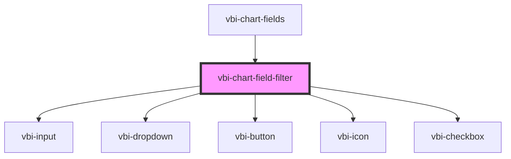

# vbi-chart-field-filter

<!-- Auto Generated Below -->

## Properties

| Property        | Attribute | Description                         | Type          | Default |
| --------------- | --------- | ----------------------------------- | ------------- | ------- |
| `keyword`       | `keyword` | The current search keyword.         | `string`      | `''`    |
| `selectedRoles` | --        | The currently selected field roles. | `FieldRole[]` | `[]`    |
| `selectedTypes` | --        | The currently selected field types. | `string[]`    | `[]`    |

## Events

| Event                        | Description                                                              | Type                       |
| ---------------------------- | ------------------------------------------------------------------------ | -------------------------- |
| `vbiChartFieldFilterKeyword` | Emitted when the user changes the search keyword.                        | `CustomEvent<string>`      |
| `vbiChartFieldFilterRole`    | Emitted when the user changes the selected roles in the filter dropdown. | `CustomEvent<FieldRole[]>` |
| `vbiChartFieldFilterType`    | Emitted when the user changes the selected types in the filter dropdown. | `CustomEvent<string[]>`    |

## Dependencies

### Used by

 - [vbi-chart-fields](../vbi-chart-fields)

### Depends on

- [vbi-input](../../../ui/vbi-input)
- [vbi-dropdown](../../../ui/vbi-dropdown)
- [vbi-button](../../../ui/vbi-button)
- [vbi-icon](../../../ui/vbi-icon)
- [vbi-checkbox](../../../ui/vbi-checkbox)

### Graph

----------------------------------------------

*Built with [StencilJS](https://stenciljs.com/)*
