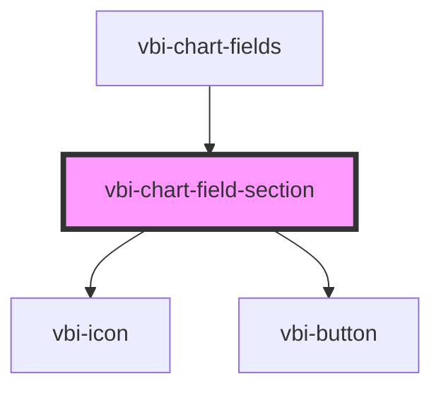

# vbi-chart-field-section

<!-- Auto Generated Below -->

## Properties

| Property     | Attribute | Description                        | Type               | Default |
| ------------ | --------- | ---------------------------------- | ------------------ | ------- |
| `dimensions` | --        | The list of dimensions to display. | `VBISchemaField[]` | `[]`    |
| `measures`   | --        | The list of measures to display.   | `VBISchemaField[]` | `[]`    |

## Dependencies

### Used by

 - [vbi-chart-fields](../vbi-chart-fields)

### Depends on

- [vbi-icon](../../../ui/vbi-icon)
- [vbi-button](../../../ui/vbi-button)

### Graph

----------------------------------------------

*Built with [StencilJS](https://stenciljs.com/)*
