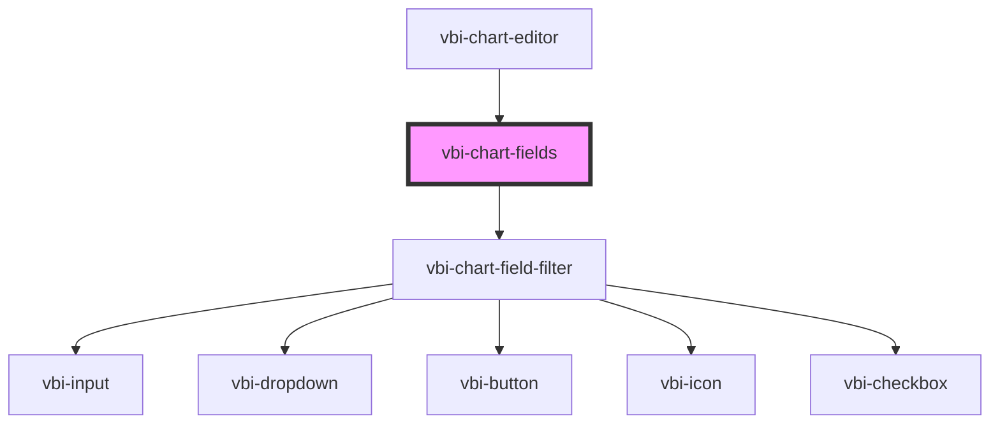

# vbi-chart-fields

<!-- Auto Generated Below -->

## Dependencies

### Used by

 - [vbi-chart-editor](../../vbi-chart-editor)

### Depends on

- [vbi-chart-field-filter](../vbi-chart-field-filter)

### Graph

----------------------------------------------

*Built with [StencilJS](https://stenciljs.com/)*
