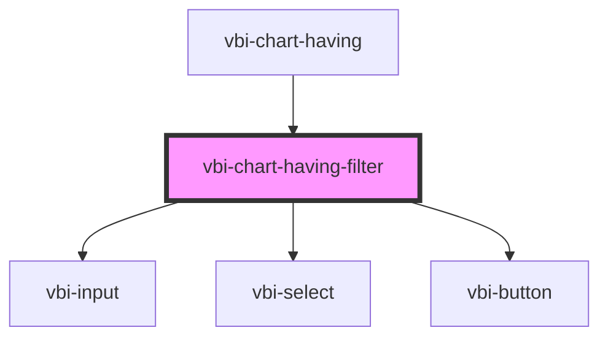

# vbi-chart-having-filter

<!-- Auto Generated Below -->

## Properties

| Property            | Attribute | Description | Type                                                                                                                                                                                                                                                                         | Default     |
| ------------------- | --------- | ----------- | ---------------------------------------------------------------------------------------------------------------------------------------------------------------------------------------------------------------------------------------------------------------------------- | ----------- |
| `fieldRoleMap`      | --        |             | `string`                                                                                                                                                                                                                                                                     | `{}`        |
| `fieldTypeMap`      | --        |             | `string`                                                                                                                                                                                                                                                                     | `{}`        |
| `item` _(required)_ | --        |             | `{ id?: string; field: string; aggregate?: { func: "count" \| "sum" \| "avg" \| "min" \| "max" \| "variance" \| "stddev" \| "median" \| "countDistinct" \| "variancePop"; } \| { func: "quantile"; quantile?: number; }; operator?: string; op?: string; value?: unknown; }` | `undefined` |

## Events

| Event                        | Description | Type                                                           |
| ---------------------------- | ----------- | -------------------------------------------------------------- |
| `vbiChartHavingFilterCancel` |             | `CustomEvent<MouseEvent>`                                      |
| `vbiChartHavingFilterSave`   |             | `CustomEvent<{ item: HavingFilterLike; event?: MouseEvent; }>` |

## Dependencies

### Used by

 - [vbi-chart-having](../vbi-chart-having)

### Depends on

- [vbi-input](../../../ui/vbi-input)
- [vbi-select](../../../ui/vbi-select)
- [vbi-button](../../../ui/vbi-button)

### Graph

----------------------------------------------

*Built with [StencilJS](https://stenciljs.com/)*
