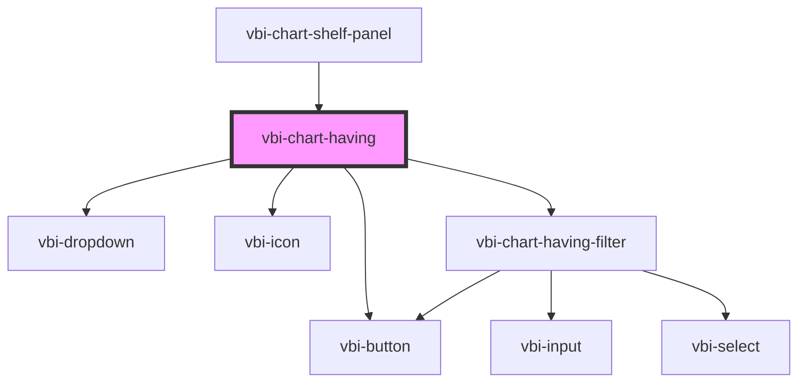

# vbi-chart-having

<!-- Auto Generated Below -->

## Dependencies

### Used by

 - [vbi-chart-shelf-panel](../vbi-chart-shelf-panel)

### Depends on

- [vbi-dropdown](../../../ui/vbi-dropdown)
- [vbi-button](../../../ui/vbi-button)
- [vbi-icon](../../../ui/vbi-icon)
- [vbi-chart-having-filter](../vbi-chart-having-filter)

### Graph

----------------------------------------------

*Built with [StencilJS](https://stenciljs.com/)*
