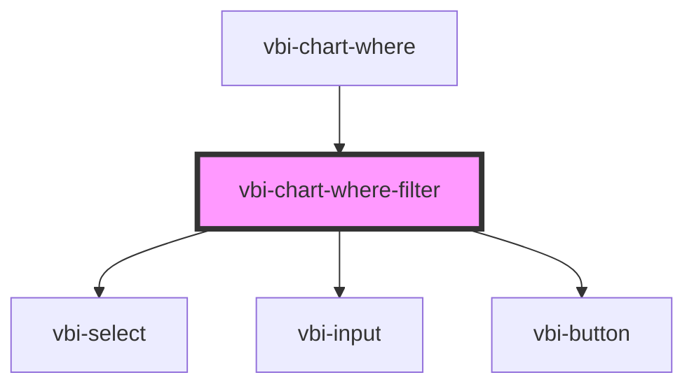

# vbi-chart-where-filter

<!-- Auto Generated Below -->

## Properties

| Property            | Attribute | Description | Type                                                                               | Default     |
| ------------------- | --------- | ----------- | ---------------------------------------------------------------------------------- | ----------- |
| `fieldRoleMap`      | --        |             | `string`                                                                           | `{}`        |
| `fieldTypeMap`      | --        |             | `string`                                                                           | `{}`        |
| `item` _(required)_ | --        |             | `{ id?: string; field: string; operator?: string; op?: string; value?: unknown; }` | `undefined` |

## Events

| Event                       | Description | Type                                                          |
| --------------------------- | ----------- | ------------------------------------------------------------- |
| `vbiChartWhereFilterCancel` |             | `CustomEvent<MouseEvent>`                                     |
| `vbiChartWhereFilterSave`   |             | `CustomEvent<{ item: WhereFilterLike; event?: MouseEvent; }>` |

## Dependencies

### Used by

 - [vbi-chart-where](../vbi-chart-where)

### Depends on

- [vbi-select](../../../ui/vbi-select)
- [vbi-input](../../../ui/vbi-input)
- [vbi-button](../../../ui/vbi-button)

### Graph

----------------------------------------------

*Built with [StencilJS](https://stenciljs.com/)*
