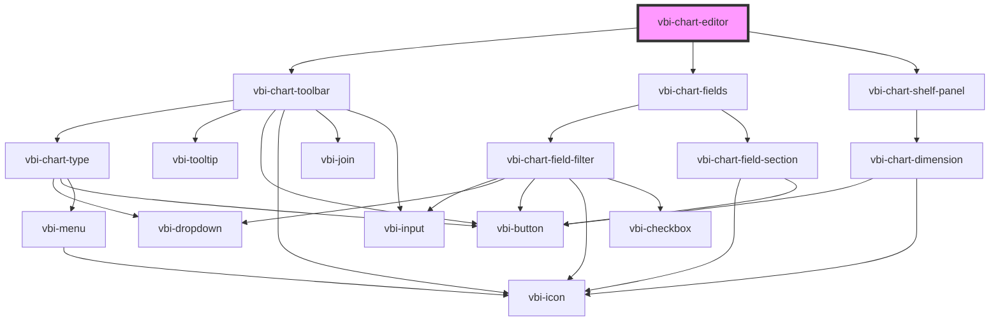

# vbi-chart-editor

<!-- Auto Generated Below -->

## Dependencies

### Depends on

- [vbi-chart-toolbar](../vbi-chart-toolbar)
- [vbi-chart-fields](../fields/vbi-chart-fields)
- [vbi-chart-shelf-panel](../shelves/vbi-chart-shelf-panel)

### Graph

----------------------------------------------

*Built with [StencilJS](https://stenciljs.com/)*
