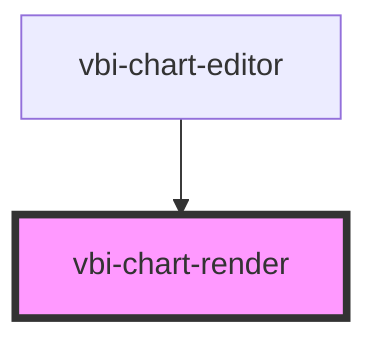

# vbi-chart-render

<!-- Auto Generated Below -->

## Properties

| Property | Attribute | Description                                                       | Type                                                                                                                                                                                                                                                                                                                                                                                                        | Default     |
| -------- | --------- | ----------------------------------------------------------------- | ----------------------------------------------------------------------------------------------------------------------------------------------------------------------------------------------------------------------------------------------------------------------------------------------------------------------------------------------------------------------------------------------------------- | ----------- |
| `vseed`  | --        | The VSeed configuration object used to render the chart or table. | `Area \| AreaPercent \| Bar \| BarParallel \| BarPercent \| BoxPlot \| CirclePacking \| Column \| ColumnParallel \| ColumnPercent \| Donut \| DualAxis \| Funnel \| Heatmap \| HierarchySankey \| Histogram \| Line \| Pie \| PivotTable \| RaceBar \| RaceColumn \| RaceDonut \| RaceLine \| RacePie \| RaceScatter \| Radar \| Rose \| RoseParallel \| Sankey \| Scatter \| Sunburst \| Table \| TreeMap` | `undefined` |

## Dependencies

### Used by

 - [vbi-chart-editor](../vbi-chart-editor)

### Graph

----------------------------------------------

*Built with [StencilJS](https://stenciljs.com/)*
