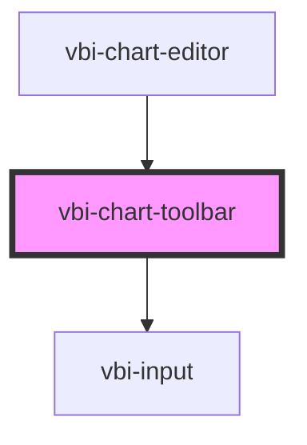

# vbi-chart-toolbar

<!-- Auto Generated Below -->

## Dependencies

### Used by

 - [vbi-chart-editor](../vbi-chart-editor)

### Depends on

- [vbi-input](../../ui/vbi-input)

### Graph

----------------------------------------------

*Built with [StencilJS](https://stenciljs.com/)*
