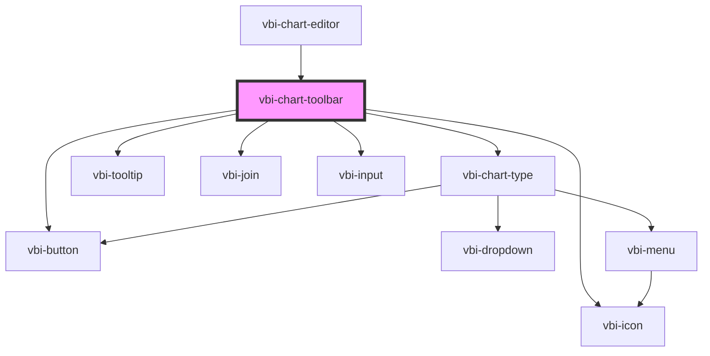

# vbi-chart-toolbar

<!-- Auto Generated Below -->

## Dependencies

### Used by

 - [vbi-chart-editor](../vbi-chart-editor)

### Depends on

- [vbi-chart-type](../vbi-chart-type)
- [vbi-tooltip](../../ui/vbi-tooltip)
- [vbi-button](../../ui/vbi-button)
- [vbi-icon](../../ui/vbi-icon)
- [vbi-join](../../ui/vbi-join)
- [vbi-input](../../ui/vbi-input)

### Graph

----------------------------------------------

*Built with [StencilJS](https://stenciljs.com/)*
