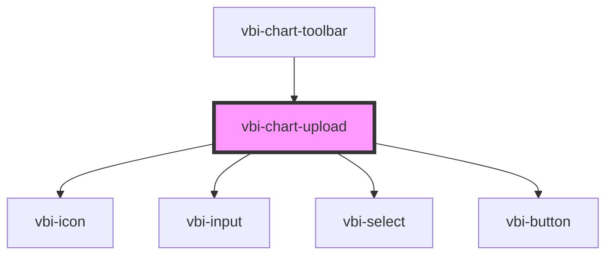

# vbi-chart-upload

<!-- Auto Generated Below -->

## Properties

| Property            | Attribute             | Description                                   | Type     | Default       |
| ------------------- | --------------------- | --------------------------------------------- | -------- | ------------- |
| `connectorIdPrefix` | `connector-id-prefix` | Prefix for generated local CSV connector IDs. | `string` | `'local_csv'` |

## Events

| Event                   | Description                                                                         | Type                                                                        |
| ----------------------- | ----------------------------------------------------------------------------------- | --------------------------------------------------------------------------- |
| `vbiChartUploadSuccess` | Emitted when a CSV file is successfully uploaded and imported into the chart store. | `CustomEvent<{ connectorId: string; fileName: string; rowCount: number; }>` |

## Dependencies

### Used by

 - [vbi-chart-toolbar](../vbi-chart-toolbar)

### Depends on

- [vbi-icon](../../ui/vbi-icon)
- [vbi-input](../../ui/vbi-input)
- [vbi-select](../../ui/vbi-select)
- [vbi-button](../../ui/vbi-button)

### Graph

----------------------------------------------

*Built with [StencilJS](https://stenciljs.com/)*
