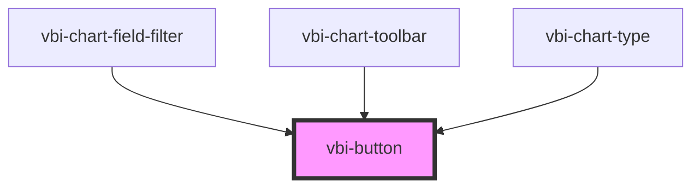

# vbi-button

<!-- Auto Generated Below -->

## Properties

| Property   | Attribute  | Description                                       | Type                                                                                               | Default     |
| ---------- | ---------- | ------------------------------------------------- | -------------------------------------------------------------------------------------------------- | ----------- |
| `active`   | `active`   | Active state (pressed/selected)                   | `boolean`                                                                                          | `false`     |
| `color`    | `color`    | Main color (primary, secondary, accent, etc.)     | `"accent" \| "error" \| "info" \| "neutral" \| "primary" \| "secondary" \| "success" \| "warning"` | `undefined` |
| `disabled` | `disabled` | Disabled state                                    | `boolean`                                                                                          | `false`     |
| `shape`    | `shape`    | Shape (square, circle, wide, block)               | `"block" \| "circle" \| "square" \| "wide"`                                                        | `undefined` |
| `size`     | `size`     | Size (xs, sm, md, lg, xl)                         | `"lg" \| "md" \| "sm" \| "xl" \| "xs"`                                                             | `undefined` |
| `type`     | `type`     | Type of the button                                | `"button" \| "reset" \| "submit"`                                                                  | `'button'`  |
| `variant`  | `variant`  | Button variant (ghost, outline, dash, soft, link) | `"dash" \| "ghost" \| "link" \| "outline" \| "soft"`                                               | `undefined` |

## Dependencies

### Used by

 - [vbi-chart-field-filter](../../chart/fields/vbi-chart-field-filter)
 - [vbi-chart-toolbar](../../chart/vbi-chart-toolbar)
 - [vbi-chart-type](../../chart/vbi-chart-type)

### Graph

----------------------------------------------

*Built with [StencilJS](https://stenciljs.com/)*
