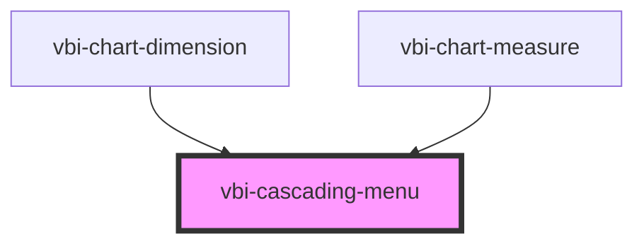

# vbi-cascading-menu

<!-- Auto Generated Below -->

## Properties

| Property  | Attribute | Description                                                 | Type                                   | Default      |
| --------- | --------- | ----------------------------------------------------------- | -------------------------------------- | ------------ |
| `items`   | --        | Array of menu items to be rendered                          | `CascadingMenuItem[]`                  | `[]`         |
| `size`    | `size`    | The size of the menu. Defaults to 'md'                      | `"lg" \| "md" \| "sm" \| "xl" \| "xs"` | `'md'`       |
| `variant` | `variant` | The orientation variant of the menu. Defaults to 'vertical' | `"horizontal" \| "vertical"`           | `'vertical'` |

## Events

| Event                    | Description                       | Type                             |
| ------------------------ | --------------------------------- | -------------------------------- |
| `vbiCascadingMenuSelect` | Fired when a menu item is clicked | `CustomEvent<CascadingMenuItem>` |

## Dependencies

### Used by

 - [vbi-chart-dimension](../../chart/shelves/vbi-chart-dimension)
 - [vbi-chart-measure](../../chart/shelves/vbi-chart-measure)

### Graph

----------------------------------------------

*Built with [StencilJS](https://stenciljs.com/)*
