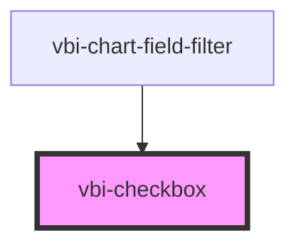

# vbi-checkbox

<!-- Auto Generated Below -->

## Properties

| Property        | Attribute       | Description                                          | Type                                                                                               | Default     |
| --------------- | --------------- | ---------------------------------------------------- | -------------------------------------------------------------------------------------------------- | ----------- |
| `checked`       | `checked`       | Whether the component is checked.                    | `boolean`                                                                                          | `false`     |
| `color`         | `color`         | The theme color of the component.                    | `"accent" \| "error" \| "info" \| "neutral" \| "primary" \| "secondary" \| "success" \| "warning"` | `undefined` |
| `disabled`      | `disabled`      | Whether the component is disabled.                   | `boolean`                                                                                          | `false`     |
| `indeterminate` | `indeterminate` | Whether the checkbox is in an indeterminate state.   | `boolean`                                                                                          | `false`     |
| `name`          | `name`          | The name of the component, used for form submission. | `string`                                                                                           | `''`        |
| `size`          | `size`          | The size of the component.                           | `"lg" \| "md" \| "sm" \| "xl" \| "xs"`                                                             | `undefined` |

## Events

| Event               | Description                              | Type                   |
| ------------------- | ---------------------------------------- | ---------------------- |
| `vbiCheckboxChange` | Emitted when the checkbox value changes. | `CustomEvent<boolean>` |

## Dependencies

### Used by

 - [vbi-chart-field-filter](../../chart/fields/vbi-chart-field-filter)

### Graph

----------------------------------------------

*Built with [StencilJS](https://stenciljs.com/)*
