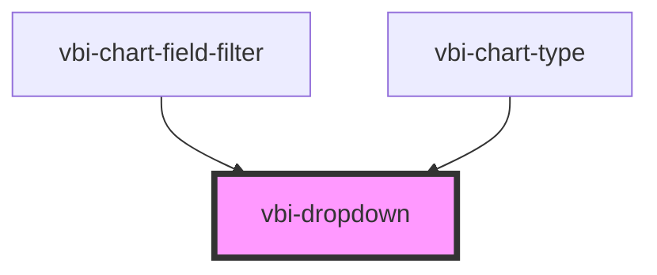

# vbi-dropdown

<!-- Auto Generated Below -->

## Properties

| Property      | Attribute      | Description                                                                              | Type                                     | Default    |
| ------------- | -------------- | ---------------------------------------------------------------------------------------- | ---------------------------------------- | ---------- |
| `disabled`    | `disabled`     | When true, the dropdown cannot be opened.                                                | `boolean`                                | `false`    |
| `offset`      | `offset`       | The distance between the dropdown and its trigger (in pixels).                           | `number`                                 | `8`        |
| `open`        | `open`         | Controls the open state of the dropdown.                                                 | `boolean`                                | `false`    |
| `placement`   | `placement`    | The position of the dropdown relative to its trigger.                                    | `"bottom" \| "left" \| "right" \| "top"` | `'bottom'` |
| `popoverMode` | `popover-mode` | The interaction mode of the popover ('auto' closes on outside click, 'manual' does not). | `"auto" \| "manual"`                     | `'auto'`   |
| `trigger`     | `trigger`      | How the dropdown is triggered.                                                           | `"click" \| "hover"`                     | `'click'`  |

## Events

| Event               | Description                                | Type                   |
| ------------------- | ------------------------------------------ | ---------------------- |
| `vbiDropdownToggle` | Emitted when the dropdown opens or closes. | `CustomEvent<boolean>` |

## Dependencies

### Used by

 - [vbi-chart-field-filter](../../chart/fields/vbi-chart-field-filter)
 - [vbi-chart-type](../../chart/vbi-chart-type)

### Graph

----------------------------------------------

*Built with [StencilJS](https://stenciljs.com/)*
