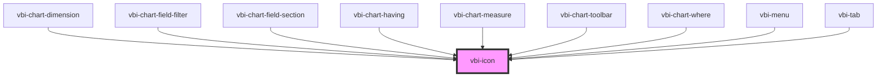

# vbi-icon

<!-- Auto Generated Below -->

## Properties

| Property | Attribute | Description                                              | Type             | Default          |
| -------- | --------- | -------------------------------------------------------- | ---------------- | ---------------- |
| `color`  | `color`   | The color of the icon. Defaults to 'currentColor'.       | `string`         | `'currentColor'` |
| `icon`   | --        | The icon definition object from `@ant-design/icons-svg`. | `IconDefinition` | `undefined`      |
| `size`   | `size`    | The size of the icon (e.g., '16px', '1em', '2rem').      | `string`         | `'1em'`          |

## Dependencies

### Used by

 - [vbi-chart-dimension](../../chart/shelves/vbi-chart-dimension)
 - [vbi-chart-field-filter](../../chart/fields/vbi-chart-field-filter)
 - [vbi-chart-field-section](../../chart/fields/vbi-chart-field-section)
 - [vbi-chart-having](../../chart/shelves/vbi-chart-having)
 - [vbi-chart-measure](../../chart/shelves/vbi-chart-measure)
 - [vbi-chart-toolbar](../../chart/vbi-chart-toolbar)
 - [vbi-chart-where](../../chart/shelves/vbi-chart-where)
 - [vbi-menu](../vbi-menu)
 - [vbi-tab](../vbi-tab)

### Graph

----------------------------------------------

*Built with [StencilJS](https://stenciljs.com/)*
