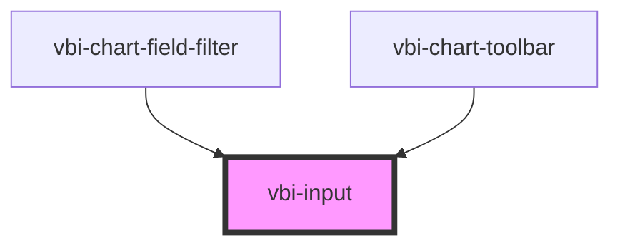

# vbi-input

<!-- Auto Generated Below -->

## Properties

| Property       | Attribute      | Description                                                        | Type                                                                                               | Default     |
| -------------- | -------------- | ------------------------------------------------------------------ | -------------------------------------------------------------------------------------------------- | ----------- |
| `autocomplete` | `autocomplete` | Autocomplete hint for the browser                                  | `string`                                                                                           | `undefined` |
| `autofocus`    | `autofocus`    | Auto-focus the input on mount                                      | `boolean`                                                                                          | `false`     |
| `color`        | `color`        | Primary color (primary, secondary, info, error...)                 | `"accent" \| "error" \| "info" \| "neutral" \| "primary" \| "secondary" \| "success" \| "warning"` | `undefined` |
| `disabled`     | `disabled`     | Disabled state                                                     | `boolean`                                                                                          | `false`     |
| `max`          | `max`          | Maximum value for number or date input                             | `number \| string`                                                                                 | `undefined` |
| `maxlength`    | `maxlength`    | Maximum character length                                           | `number`                                                                                           | `undefined` |
| `min`          | `min`          | Minimum value for number or date input                             | `number \| string`                                                                                 | `undefined` |
| `minlength`    | `minlength`    | Minimum character length                                           | `number`                                                                                           | `undefined` |
| `name`         | `name`         | Name attribute for form submission                                 | `string`                                                                                           | `undefined` |
| `placeholder`  | `placeholder`  | Placeholder text                                                   | `string`                                                                                           | `''`        |
| `readOnly`     | `readonly`     | Read-only state (focusable but not editable)                       | `boolean`                                                                                          | `false`     |
| `required`     | `required`     | Required field for form validation                                 | `boolean`                                                                                          | `false`     |
| `size`         | `size`         | Size of the input                                                  | `"lg" \| "md" \| "sm" \| "xl" \| "xs"`                                                             | `undefined` |
| `step`         | `step`         | Step for number input                                              | `number \| string`                                                                                 | `undefined` |
| `type`         | `type`         | Type of the input element (text, password, email, number, date...) | `string`                                                                                           | `'text'`    |
| `value`        | `value`        | Value of the input element                                         | `number \| string`                                                                                 | `''`        |
| `variant`      | `variant`      | Display variant (e.g., ghost - transparent)                        | `"ghost"`                                                                                          | `undefined` |

## Events

| Event            | Description                                                              | Type                  |
| ---------------- | ------------------------------------------------------------------------ | --------------------- |
| `vbiInputBlur`   | Event emitted when the input loses focus (blur)                          | `CustomEvent<void>`   |
| `vbiInputChange` | Event emitted when the user finishes typing and blurs (or presses Enter) | `CustomEvent<string>` |
| `vbiInputFocus`  | Event emitted when the input gains focus                                 | `CustomEvent<void>`   |
| `vbiInputValue`  | Event emitted when the user types                                        | `CustomEvent<string>` |

## Dependencies

### Used by

 - [vbi-chart-field-filter](../../chart/fields/vbi-chart-field-filter)
 - [vbi-chart-toolbar](../../chart/vbi-chart-toolbar)

### Graph

----------------------------------------------

*Built with [StencilJS](https://stenciljs.com/)*
