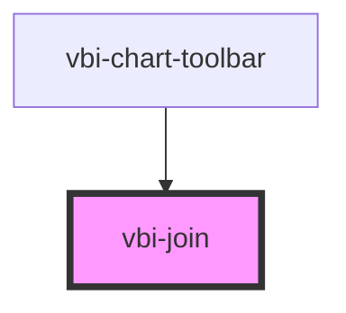

# vbi-join

<!-- Auto Generated Below -->

## Properties

| Property   | Attribute  | Description          | Type      | Default |
| ---------- | ---------- | -------------------- | --------- | ------- |
| `vertical` | `vertical` | Vertical orientation | `boolean` | `false` |

## Dependencies

### Used by

 - [vbi-chart-toolbar](../../chart/vbi-chart-toolbar)

### Graph

----------------------------------------------

*Built with [StencilJS](https://stenciljs.com/)*
