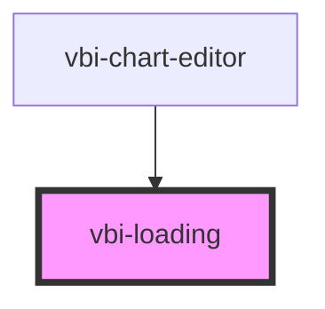

# vbi-loading

<!-- Auto Generated Below -->

## Properties

| Property | Attribute | Description                                                                                | Type                                                                                               | Default     |
| -------- | --------- | ------------------------------------------------------------------------------------------ | -------------------------------------------------------------------------------------------------- | ----------- |
| `color`  | `color`   | Primary color. If not provided, it inherits the parent element's text color (currentColor) | `"accent" \| "error" \| "info" \| "neutral" \| "primary" \| "secondary" \| "success" \| "warning"` | `undefined` |
| `size`   | `size`    | Size (xs, sm, md, lg, xl)                                                                  | `"lg" \| "md" \| "sm" \| "xl" \| "xs"`                                                             | `undefined` |
| `type`   | `type`    | Loading style (spinner, dots, ring, ball, bars, infinity)                                  | `"ball" \| "bars" \| "dots" \| "infinity" \| "ring" \| "spinner"`                                  | `'spinner'` |

## Dependencies

### Used by

 - [vbi-chart-editor](../../chart/vbi-chart-editor)

### Graph

----------------------------------------------

*Built with [StencilJS](https://stenciljs.com/)*
