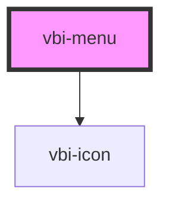

# vbi-menu

<!-- Auto Generated Below -->

## Properties

| Property  | Attribute | Description                                                 | Type                                   | Default      |
| --------- | --------- | ----------------------------------------------------------- | -------------------------------------- | ------------ |
| `items`   | --        | Array of menu items to be rendered                          | `MenuItem[]`                           | `[]`         |
| `size`    | `size`    | The size of the menu. Defaults to 'md'                      | `"lg" \| "md" \| "sm" \| "xl" \| "xs"` | `'md'`       |
| `variant` | `variant` | The orientation variant of the menu. Defaults to 'vertical' | `"horizontal" \| "vertical"`           | `'vertical'` |

## Events

| Event           | Description                       | Type                    |
| --------------- | --------------------------------- | ----------------------- |
| `vbiMenuSelect` | Fired when a menu item is clicked | `CustomEvent<MenuItem>` |

## Dependencies

### Depends on

- [vbi-icon](../vbi-icon)

### Graph

----------------------------------------------

*Built with [StencilJS](https://stenciljs.com/)*
