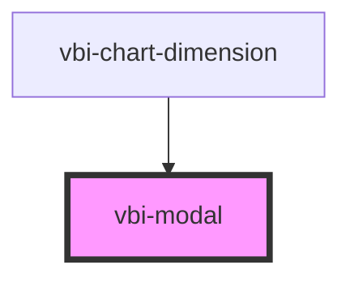

# vbi-modal

<!-- Auto Generated Below -->

## Properties

| Property   | Attribute  | Description | Type                                                | Default    |
| ---------- | ---------- | ----------- | --------------------------------------------------- | ---------- |
| `open`     | `open`     |             | `boolean`                                           | `false`    |
| `position` | `position` |             | `"bottom" \| "end" \| "middle" \| "start" \| "top"` | `'middle'` |

## Events

| Event            | Description | Type                   |
| ---------------- | ----------- | ---------------------- |
| `vbiModalToggle` |             | `CustomEvent<boolean>` |

## Dependencies

### Used by

 - [vbi-chart-dimension](../../chart/shelves/vbi-chart-dimension)

### Graph

----------------------------------------------

*Built with [StencilJS](https://stenciljs.com/)*
