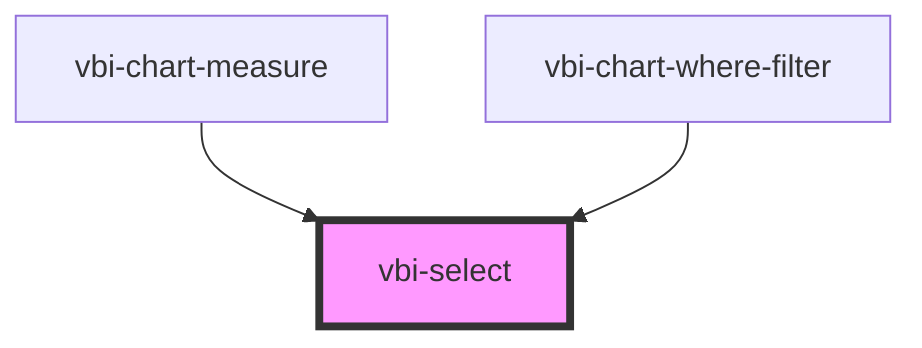

# vbi-select

<!-- Auto Generated Below -->

## Properties

| Property      | Attribute     | Description                                 | Type                                                                                                          | Default     |
| ------------- | ------------- | ------------------------------------------- | ------------------------------------------------------------------------------------------------------------- | ----------- |
| `color`       | `color`       | Color variant of the select                 | `"accent" \| "error" \| "ghost" \| "info" \| "neutral" \| "primary" \| "secondary" \| "success" \| "warning"` | `undefined` |
| `disabled`    | `disabled`    | Whether the select is disabled              | `boolean`                                                                                                     | `false`     |
| `options`     | --            | List of select options                      | `SelectOption[]`                                                                                              | `undefined` |
| `placeholder` | `placeholder` | Placeholder text when no option is selected | `string`                                                                                                      | `undefined` |
| `size`        | `size`        | Size of the select                          | `"lg" \| "md" \| "sm" \| "xl" \| "xs"`                                                                        | `undefined` |
| `value`       | `value`       | Current value of the select                 | `number \| string`                                                                                            | `undefined` |

## Events

| Event             | Description                                       | Type                  |
| ----------------- | ------------------------------------------------- | --------------------- |
| `vbiSelectChange` | Emitted when the user changes the selected option | `CustomEvent<string>` |

## Dependencies

### Used by

 - [vbi-chart-measure](../../chart/shelves/vbi-chart-measure)
 - [vbi-chart-where-filter](../../chart/shelves/vbi-chart-where-filter)

### Graph

----------------------------------------------

*Built with [StencilJS](https://stenciljs.com/)*
