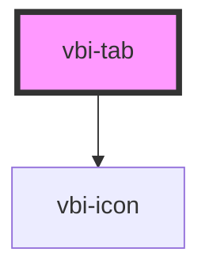

# vbi-tab

<!-- Auto Generated Below -->

## Properties

| Property   | Attribute  | Description                       | Type                                   | Default     |
| ---------- | ---------- | --------------------------------- | -------------------------------------- | ----------- |
| `disabled` | `disabled` | Whether all tabs are disabled     | `boolean`                              | `false`     |
| `items`    | --         | Array of tab items to be rendered | `TabItem[]`                            | `[]`        |
| `size`     | `size`     | Size of the tabs                  | `"lg" \| "md" \| "sm" \| "xl" \| "xs"` | `undefined` |
| `value`    | `value`    | Currently active tab value or ID  | `number \| string`                     | `undefined` |

## Events

| Event          | Description                        | Type                   |
| -------------- | ---------------------------------- | ---------------------- |
| `vbiTabChange` | Emitted when a tab item is clicked | `CustomEvent<TabItem>` |

## Dependencies

### Depends on

- [vbi-icon](../vbi-icon)

### Graph

----------------------------------------------

*Built with [StencilJS](https://stenciljs.com/)*
