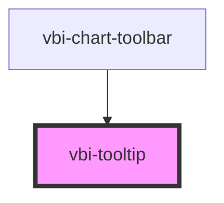

# vbi-tooltip

<!-- Auto Generated Below -->

## Properties

| Property   | Attribute  | Description                                        | Type                                                                                  | Default     |
| ---------- | ---------- | -------------------------------------------------- | ------------------------------------------------------------------------------------- | ----------- |
| `color`    | `color`    | The semantic color theme of the tooltip            | `"accent" \| "error" \| "info" \| "primary" \| "secondary" \| "success" \| "warning"` | `undefined` |
| `open`     | `open`     | Whether the tooltip is currently open/visible      | `boolean`                                                                             | `false`     |
| `position` | `position` | The position of the tooltip relative to its target | `"bottom" \| "left" \| "right" \| "top"`                                              | `'top'`     |
| `text`     | `text`     | The text to display inside the tooltip             | `string`                                                                              | `''`        |

## Dependencies

### Used by

 - [vbi-chart-toolbar](../../chart/vbi-chart-toolbar)

### Graph

----------------------------------------------

*Built with [StencilJS](https://stenciljs.com/)*
