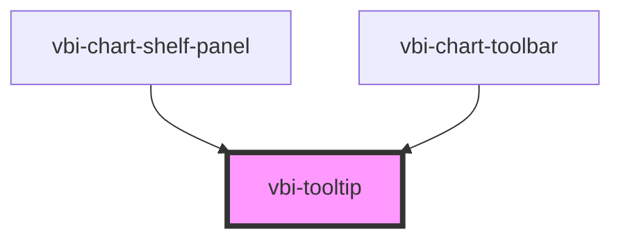

# vbi-tooltip

<!-- Auto Generated Below -->

## Properties

| Property     | Attribute     | Description                                                  | Type                                                                                                                                                                 | Default     |
| ------------ | ------------- | ------------------------------------------------------------ | -------------------------------------------------------------------------------------------------------------------------------------------------------------------- | ----------- |
| `color`      | `color`       | The semantic color theme of the tooltip                      | `"accent" \| "error" \| "info" \| "primary" \| "secondary" \| "success" \| "warning"`                                                                                | `undefined` |
| `enterDelay` | `enter-delay` | Delay in milliseconds before showing the tooltip on hover    | `number`                                                                                                                                                             | `0`         |
| `leaveDelay` | `leave-delay` | Delay in milliseconds before hiding the tooltip on leave     | `number`                                                                                                                                                             | `0`         |
| `offset`     | `offset`      | The distance between the tooltip and its trigger (in pixels) | `number`                                                                                                                                                             | `8`         |
| `open`       | `open`        | Whether the tooltip is currently open/visible                | `boolean`                                                                                                                                                            | `false`     |
| `position`   | `position`    | The position of the tooltip relative to its target           | `"bottom" \| "bottom-end" \| "bottom-start" \| "left" \| "left-end" \| "left-start" \| "right" \| "right-end" \| "right-start" \| "top" \| "top-end" \| "top-start"` | `'top'`     |
| `text`       | `text`        | The text to display inside the tooltip                       | `string`                                                                                                                                                             | `''`        |
| `trigger`    | `trigger`     | How the tooltip is triggered ('hover', 'click', or 'manual') | `"click" \| "hover" \| "manual"`                                                                                                                                     | `'hover'`   |

## Dependencies

### Used by

 - [vbi-chart-shelf-panel](../../chart/shelves/vbi-chart-shelf-panel)
 - [vbi-chart-toolbar](../../chart/vbi-chart-toolbar)

### Graph

----------------------------------------------

*Built with [StencilJS](https://stenciljs.com/)*
